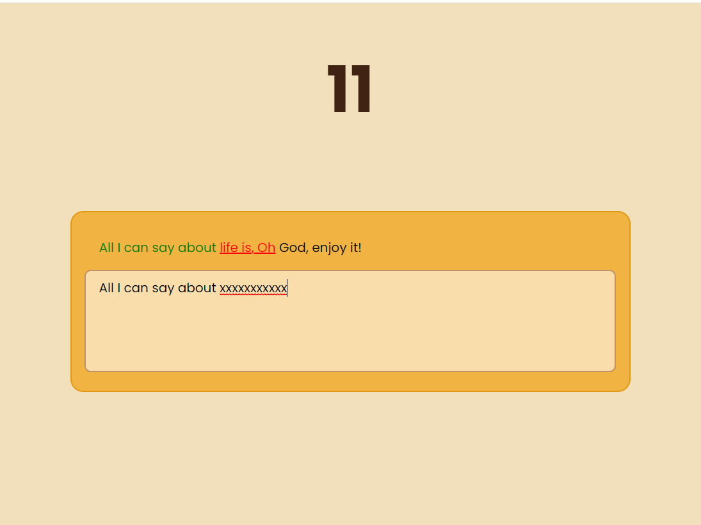

# ⌨️ Speed Typing Game

This is a speed typing game built using HTML, CSS and JavaScript. 

### ⭐ Features:

* Timer that shows the time taken
* The text gets coloured as red if your input is incorrect and green if your input is correct. 
* As soon as the whole text has been typed correctly, a second screen is shown containing:
    * the statistics of the last game, and
    * the Restart Button

### 💻 Deployed At:

#### https://speedtyping-anushkachauhan.surge.sh

